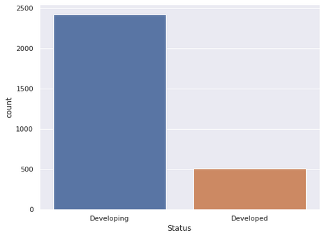
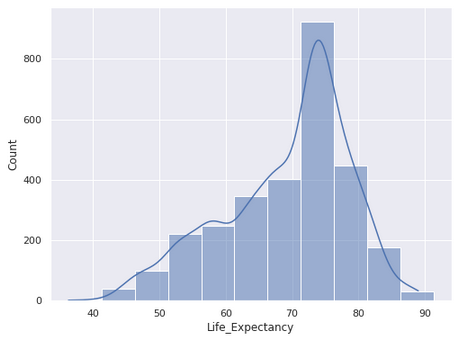
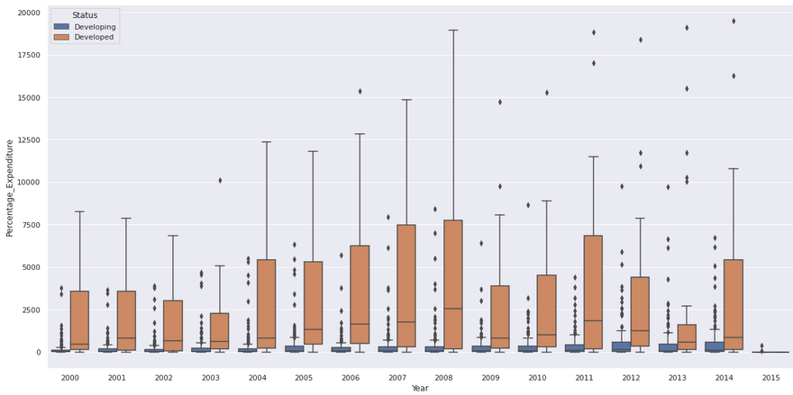
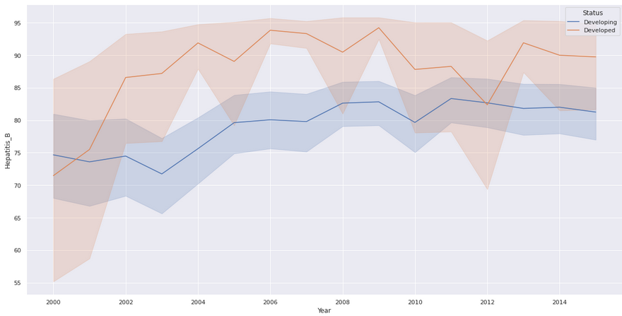

# A Multiple Linear Regression Model for Predicting Life Expectancy In Developing and Developed Countries

## Overview
This project aims to predict the life expectancy using multilinear regression model using a dataset obtained from kaggle containing information on countries such as; status, life expectancy, adult motality and many more.
### Dependancies
* python3
* numpy
* pandas
* seaborn
* sklearn
* statsmodels
* matplotlib

## Problem Statement
To investigate which elements are most closely associated with life expectancy and how they vary between different factors such as education level, status, and BMI. By doing so, it aims to identify potential areas for improvement to increase life expectancy and ultimately improve population health and well-being.

## Main Objective
To build a multilinear regression model that will predict the life expectancy of a given population.
## Specific Objectives
* To investigate if an immunization has an impact on life expectancy

* To determine if schooling affects life expectancy
 
* To determine whether adult mortality rates affect life expectancy

## Data Understanding
### Data Source
The dataset used in this project was obtained from Kaggle.
### Data Description
The Life Expectancy Data.csv contains 2938 rows and 22 columns. The columns cointain both numerical and categorical data.
### Data Preparation
The data was checked to ensure it was in useable form. This was done by checking duplicates, null values, outliers, removing white spaces and filing the missing values.

## Explanatory Data Analysis
### Count plot between developed and developing countries  

The majority of people have a life expectancy between the ages of 72-76.
### Life Expectancy distribution

The majority of people have a life expectancy between the ages of 72-76.
### Comparison of percentage expenditure between developed  and developing countries

Developed countries spend more on health than developing countries.
### Hepatitis_b and diphtheria immunization in developed and developing countries

Developed countries have more Immunization coverage among 1-year-olds as compared to the Developing countries.

## Modelling
The Multiple Linear Regression model was used for the prediction.
It involved checking correlation, creating subsets, dealing with categorical variables, binary encoding, standardizing the variables by zero centering.
The first model had an adjusted R-Squared of 74% while the second model had an adjusted R-Squared of 75%.
## Conclusion
The model predicted:
* The number of years one spends in school has a positive increase in their life expectancy 
* Getting immunized increases one's life expectancy
* The BMI range of a person also directly affects their life expectancy. People who are in the middle range, meaning neither too thin nor too fat have longer life spans. 
* Developed Nations have better health care expenditure and thus their life expectancy is higher compared to the developed countries.
* Developing countries have a lower life expectancy as compared to developed countries. This can be attributed to civil wars and economical crises.
